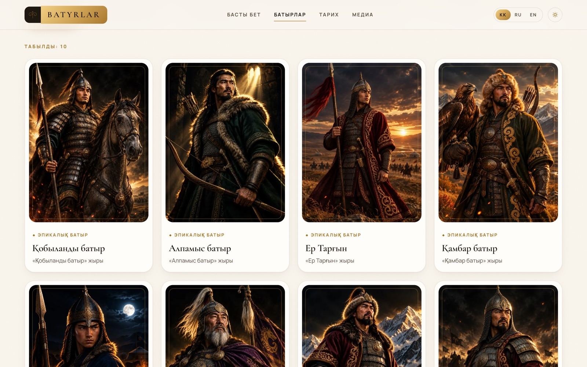
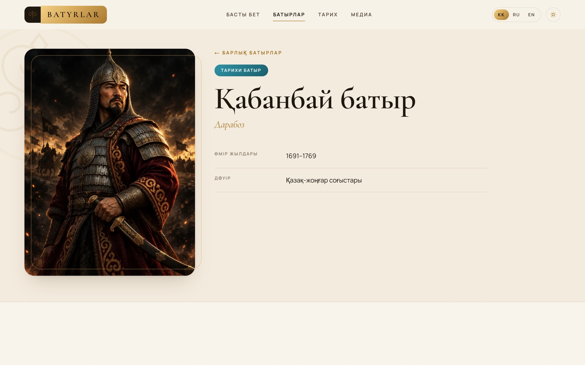
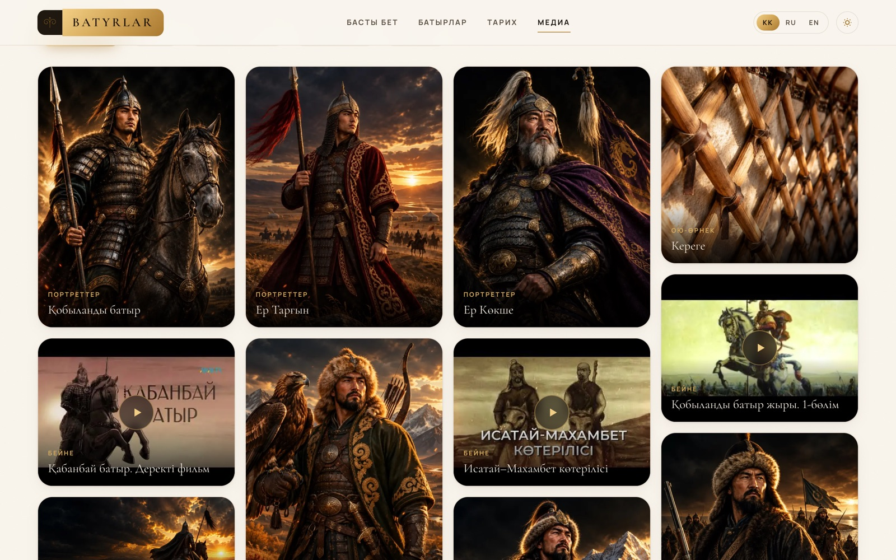
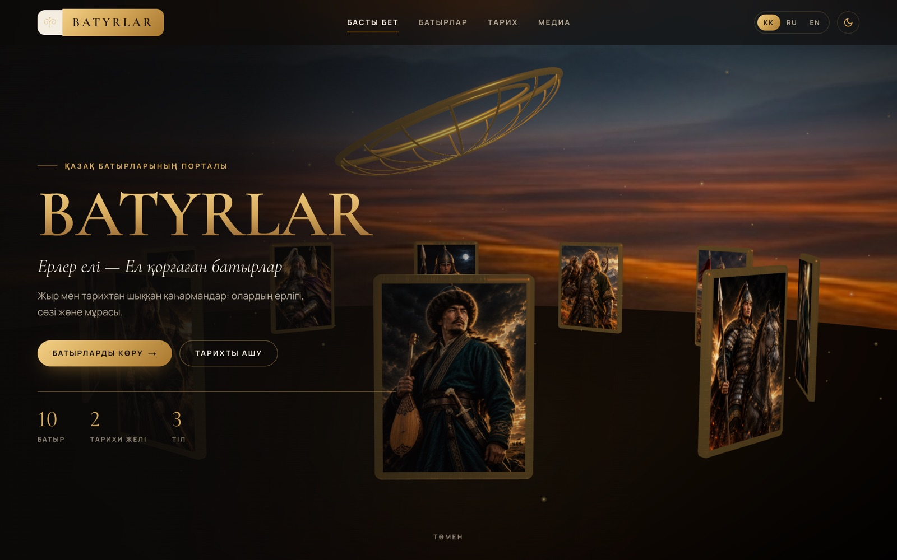

# Batyrlar.com

Портал о казахских батырах: эпические герои жыра и исторические полководцы —
биографии, ерлік істері, сюжетные желілер и галерея. Три языка (kk/ru/en),
светлая и тёмная тема, 3D-баннер на WebGL.


| Каталог | Страница батыра |
| --- | --- |
|  |  |

| Галерея и видео | Тёмная тема |
| --- | --- |
|  |  |

В репозитории две версии:

- **`web/`** — основная: Next.js 16 + React Three Fiber (Three.js) + drei + Zustand + Tailwind CSS,
  с 3D-баннером на WebGL. Запуск и подробности — в [web/README.md](web/README.md).
- **корень репозитория** — первая версия: статический сайт на HTML + CSS + ES-модулях, без сборки.
  Описан ниже, работает и дальше.

---

## Статическая версия

HTML5 + CSS3 + ES-модули, без сборки.

## Запуск

ES-модули не работают через `file://`, нужен локальный сервер:

```bash
python3 serve.py          # локальный сервер без кеша (порт 5173)
# или: python3 -m http.server 5173 / npx serve .
```

Откройте http://localhost:5173

## Структура

```
index.html            Главная: hero, карусель топ-батыров, батыр дня, категории, арки, цитата
batyrs.html           Каталог: фильтр по типу + поиск по имени (?type=epic&q=…)
batyr.html?id=…       Страница батыра: портрет, биография, ерлік істері, таймлайн, цитата, связанные
history.html          Сюжетные арки: Жоңғар соғыстары, Исатай–Махамбет (#jongar, #isatay-makhambet)
media.html            Галерея с фильтром и лайтбоксом (?cat=art|portrait|ornament)
css/  tokens · base · components (общие) · home · pages (внутренние страницы)
js/   app.js (инициализация) · motion.js · tilt.js · i18n.js · ornaments.js · layout.js · card.js · reveal.js · home.js
js/data/   batyrs.js · arcs.js
js/pages/  batyrs.js · batyr.js · history.js · media.js
assets/img/           арт и портреты (сгенерированы в Higgsfield)
```

## Open source

- **Cormorant Garamond** (заголовки) и **Manrope** (текст, подписи) — Google Fonts, лицензия OFL,
  оба поддерживают казахский алфавит (ә ғ қ ң ө ұ ү һ і).
- **Lenis** — плавная прокрутка, MIT ([github.com/darkroomengineering/lenis](https://github.com/darkroomengineering/lenis)),
  подключается с CDN; без неё сайт работает на нативном скролле.
- **Motion** — движение на скролле (`js/motion.js`): параллакс картинок и счётчики цифр, MIT
  ([github.com/motiondivision/motion](https://github.com/motiondivision/motion)).
- **vanilla-tilt.js** — 3D-наклон карточек при наведении (`js/tilt.js`), MIT
  ([github.com/micku7zu/vanilla-tilt.js](https://github.com/micku7zu/vanilla-tilt.js)).

Обе последние библиотеки грузятся динамическим `import()` с CDN и включаются только при
мыши и без `prefers-reduced-motion`; если CDN недоступен, страница просто остаётся без эффекта.

## Как расширять

- **Новый батыр**: добавьте объект в `js/data/batyrs.js`. Без `image` карточка автоматически
  рисуется градиентом из `palette` с орнаментом и монограммой.
- **Новая строка интерфейса**: добавьте ключ во все три языка в `js/i18n.js` и разметьте элемент
  `data-i18n="key"` (или `data-i18n-attr="aria-label:key"`).
- **Тема**: светлая по умолчанию, тёмная — кнопкой в шапке (сохраняется в localStorage).
  Цвета только через токены в `css/tokens.css`. Блок поверх фото помечайте классом `.scheme-dark` —
  внутри него включится тёмная палитра в любой теме.
- **Анимация при скролле**: атрибут `data-reveal` (`left` / `right` / `scale`),
  для групп `data-reveal-stagger="0.1"` на родителе.

## Контент

Данные — демонстрационные. Даты исторических батыров соответствуют общепринятым в источниках,
строки Махамбета («Ереуіл атқа ер салмай») подлинные. Остальные цитаты стилизованы
«в духе жыра / народного предания» и помечены так на сайте. Перед публикацией тексты стоит
проверить у историка или фольклориста.
