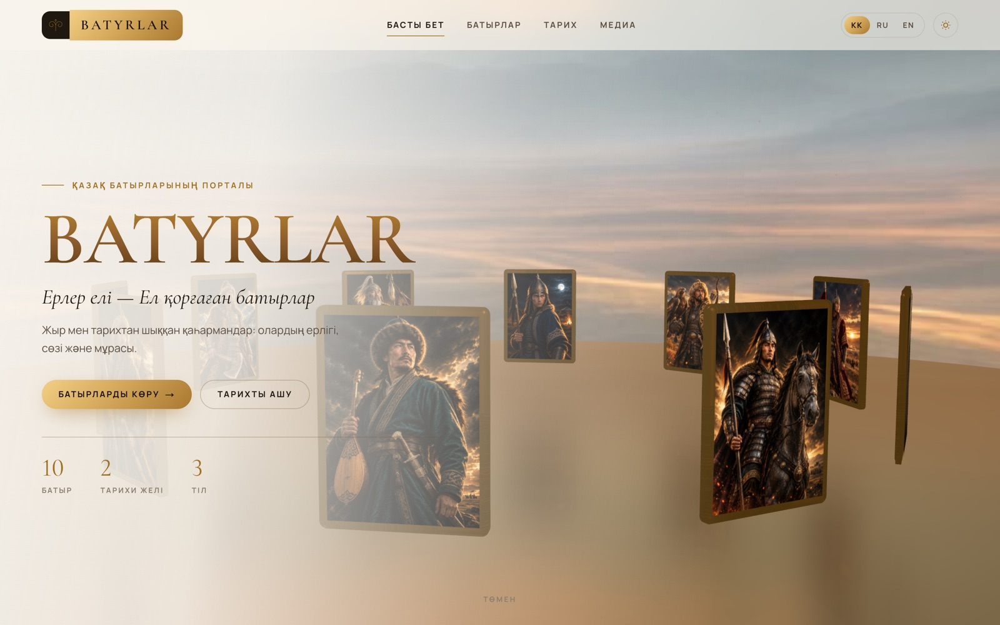

# Batyrlar — версия на Next.js + React Three Fiber

Портал о казахских батырах: 3D-баннер на WebGL, каталог, страницы батыров,
сюжетные желілер и галерея. Три языка (kk/ru/en), светлая и тёмная тема.



## Запуск

```bash
npm install
npm run dev     # http://localhost:3000
npm run build   # статический экспорт: 17 страниц в out/
```

`output: "export"` — проект собирается в статические файлы, поэтому `npm start`
не нужен: каталог `out/` можно отдавать любым сервером. Публикация настроена
на GitHub Pages, подробности — в [корневом README](../README.md#публикация).

## Стек

| Слой | Что используется |
| --- | --- |
| Каркас | **Next.js 16** (App Router, React 19, Server Components) |
| 3D | **Three.js** + **React Three Fiber** — сцена описана компонентами |
| Хелперы 3D | **drei**: `useTexture`, `RoundedBox`, `Sparkles`, `MeshReflectorMaterial`, `AdaptiveDpr` |
| Пост-обработка | **@react-three/postprocessing**: Bloom и виньетка |
| Состояние | **Zustand** — язык, тема, активный батыр сцены, лайтбокс |
| Анимации UI | **Framer Motion** — появление при скролле, переходы, лайтбокс |
| Стили | **Tailwind CSS v4** — токены темы в `@theme` (`src/app/globals.css`) |
| Прокрутка | **Lenis** |
| Картинки | Higgsfield (`public/img`), раздаются через `next/image` |
| Видео | YouTube Data API v3 (серверный запрос) + встроенный плеер youtube-nocookie |

Все пакеты ставятся из npm, отдельных CDN-подключений нет.

## Видео с YouTube

У каждого из десяти батыров есть свои ролики на казахском: жыр в исполнении
жыршы, документальные фильмы и телепередачи. Секция «Бейне» есть на странице
батыра и под аркой на «Тарих», в галерею попадает по одному ролику на батыра.

- **Без ключа** (по умолчанию) берётся список из `src/data/videos.ts` — 29 роликов,
  связанных с батырами полем `related`. Каждый id сверен запросом к публичному oEmbed
  и к странице ролика: видео существует, открыто и разрешено к встраиванию
  (`playableInEmbed`), оттуда же взята длительность.
- **С ключом** `YOUTUBE_API_KEY` (скопируйте `.env.example` в `.env.local` и вставьте ключ из
  Google Cloud → APIs & Services → Credentials) список для галереи приходит из
  `search.list` YouTube Data API v3, а длительности добираются одним запросом `videos.list`:
  запрос идёт с сервера, ответ кэшируется на сутки, ключ в браузер не попадает.
  Если API ответил ошибкой или упёрся в квоту, страница молча возвращается к списку из репозитория.

До клика на странице лежит только картинка превью — плеер (`youtube-nocookie.com`)
подставляется по нажатию, поэтому чужие скрипты не грузятся вместе со страницей.
Превью раздаёт сам YouTube, у себя мы их не храним.

## Структура

```
src/app/            маршруты: / · /batyrs · /batyrs/[id] · /history · /media
src/components/     *-view.tsx — экраны, ui.tsx — общие элементы, site-header/footer
src/components/three/   HeroScene (канвас, небо, пол, свет) · BatyrRing
src/data/           batyrs.ts (10 батыров) · arcs.ts (2 арки)
src/lib/            i18n.ts (словарь, чистый) · use-t.ts (хук) · store.ts (Zustand) · youtube.ts
src/data/videos.ts  проверенный список роликов (запасной вариант без ключа API)
public/img/         портреты, арт, панорама степи, текстура орнамента
```

## 3D-сцена

`HeroScene` рендерится только в браузере (`dynamic(..., { ssr: false })`).
Внутри: панорама степи на вывернутой сфере, пол с отражением и круг из 10 портретов
(`BatyrRing`).
Круг вращается сам, его можно крутить мышью; наведение поднимает карточку и
показывает имя, клик ведёт на страницу батыра.

Сцена не запускается при `prefers-reduced-motion` и без WebGL2 — вместо неё
статичный кадр. На экранах уже 860px отключаются сглаживание, пост-обработка и
отражение пола, а `dpr` фиксируется на 1.

## Темы и язык

Тема хранится в `localStorage` (`batyrlar.theme`) и выставляется инлайн-скриптом
до первой отрисовки, поэтому светлый фон не моргает. Тёмная палитра
переопределяет те же переменные `--color-*`, что и светлая, — утилиты
`bg-surface`, `text-ink`, `border-line` работают в обеих темах без `dark:`-дублей.

Язык (`batyrlar.lang`) живёт в Zustand; словарь `src/lib/i18n.ts` чистый и его
можно импортировать в серверные компоненты.

## Контент

Данные демонстрационные. Даты исторических батыров соответствуют общепринятым,
строки Махамбета подлинные, остальные цитаты стилизованы «в духе жыра» и помечены
так на сайте. Портреты и арт сгенерированы нейросетью — это иллюстрации, а не
исторические изображения.
